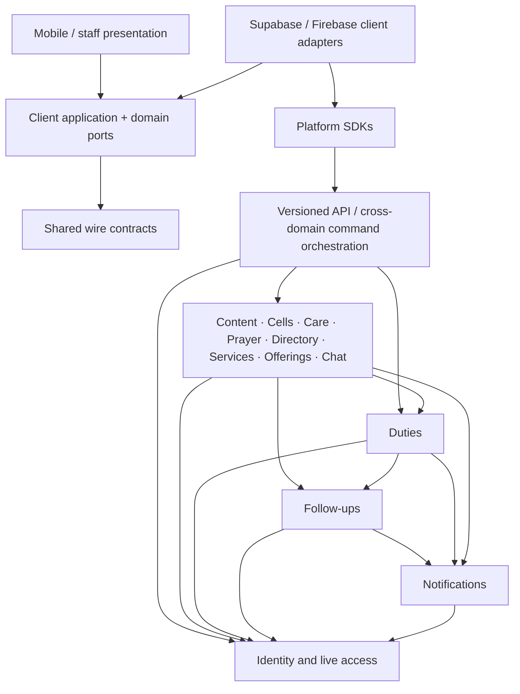
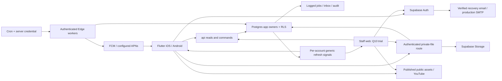
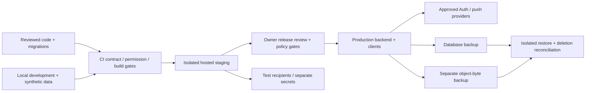

# Architecture Spine — BIC Kafue Church App v1

Read with the spec kernel and every spec companion. Behaviour, permissions and states follow the current functional-requirements.md, including the owner-approved phone/password and no-SMS change; the design contract governs presentation. Original spec 1.2 is audit-only. This initiative contract preserves all six required additions and the seven-milestone November 2026 target. CAP-17 alone is conditional.

**Fast-path status:** [ADOPTED] marks source requirements; [ASSUMPTION] marks proposed engineering mechanisms for review. Source policy proposals remain unresolved gates, even inside adopted rules. Final document status does not approve those policies or assert that implementation tests have passed. The Stack and Structural Seed are cold-start guidance; compliant code owns their detail once implemented.

## Design Paradigm

**Modular monolith:** one authoritative Supabase backend per environment, feature-owned records and transactional cross-feature commands. Layered clients share contracts; presentation depends on application/domain interfaces, while adapters implement those interfaces using platform SDKs. No second staff backend or permissions store.

Arrows below mean “may depend on/call”. Module owners expose operations; callers cannot bypass ownership with direct table writes. Every owner may depend on Identity checks. Dependencies back from owners into orchestration, presentation or adapters are forbidden.



## Invariants & Rules

### AD-1 — One modular backend with explicit ownership [ASSUMPTION]

- **Binds:** All capabilities; every client and backend module.
- **Prevents:** Separate features creating competing member, assignment, task or notification authorities.
- **Rule:** Use a modular monolith in one Supabase project per environment. Identity owns members, account links, approvals, grants and settings; Duties owns duty occurrences, slots, revisions, assignments and standalone duty recurrence; Follow-ups owns tasks/activity; Notifications owns inbox/jobs/attempts/tokens. Cells owns cell membership, canonical meeting schedules/recurrence, meetings, programmes, registers, reports and recaps; Care owns visit requests/proposals/responses; Prayer owns requests, restricted author links and replies; Directory owns opted-in projections; Offerings owns collection custody; Services owns aggregate service counts; Content owns publishing and instruction-only giving; Chat owns optional group messages. Only an owning module mutates its records. Cross-module workflows call owner operations inside one database transaction; clients and Edge adapters never coordinate independent writes to simulate it. The dependency diagram and ownership map below are binding. Cross-domain application commands may call owning modules; modules cannot call those higher-level orchestrators or import another module's presentation/adapters. All owners may use Identity access checks. Shared contracts contain types, not independent business rules.

### AD-2 — One transactional command and read contract [ASSUMPTION]

- **Binds:** All state-changing features, both clients, workers and exports.
- **Prevents:** Web/mobile disagreement, partial transitions, replayed writes and last-write-wins races.
- **Rule:** Expose only an explicit api schema. Store application tables/functions in non-exposed app, never add custom objects to auth, storage or realtime. Reads use allowlisted security_invoker views over RLS-protected tables, or audited scoped read functions. Client roles receive no direct table DML. api command wrappers use invoker security; any necessary elevated implementation lives in app with a fixed empty search_path, qualified references, minimal privileges, explicit EXECUTE grants and current actor/target checks. Revoke default PUBLIC function execution and default table exposure. The database owns each command's complete state transition, audit entry, task effects and job creation/cancellation. Mutable commands carry expected_revision and request_id. Lock the aggregate and relevant authority rows, then validate scope and revision before mutation; global lock order is Identity, domain aggregates ordered by type/ID, Follow-ups, Notifications. Persist a unique actor/command/request receipt with a payload hash in that transaction: same payload returns the original authorised result, changed payload conflicts, rollback commits no receipt. Recheck access before replaying a receipt. External calls occur after commit through durable work.

### AD-3 — Person identity and live account trust [ADOPTED]

- **Binds:** CAP-3, CAP-4; every protected read, command and subscription.
- **Prevents:** Phone numbers, refreshed tokens or UI state silently becoming membership or authority.
- **Rule:** Use stable member_id for the person and auth_user_id for the acting account; allow a member without an account and at most one active link per person/account. Phone is a normalized unverified login identifier under AD-20; household contacts are never shared identities. Linking requires reviewed identity evidence and preserves authorship/history. Church approval, confirmed primary cell, login binding and security review remain separate. [ASSUMPTION] For human-originated private access, one server predicate requires trusted password authentication in the signed session AMR, a live auth.sessions entry, the approved member/account link, current Auth phone/recovery-email binding, holds, prior activity/dormancy and current grants before access or activity refresh. Missing or exclusively otp/recovery/magiclink AMR fails closed; native email/password aliases obey the same predicate. Direct Auth changes cannot approve a replacement binding; an unapproved phone/email change blocks private access until the authorised workflow accepts it. Password reset never approves membership, clears a hold or relinks a person; older sessions are revoked and current recovery sessions stay outside private access until fresh password sign-in. No JWT role cache, user_metadata, phone equality or client role switch grants authority. Public registration, email verification/recovery and applicant-owned status use narrowly bounded non-private contracts. System work follows AD-19.

### AD-4 — Authority applies at every data surface [ADOPTED]

- **Binds:** CAP-4 and all protected tables, views, functions, storage, Realtime and exports.
- **Prevents:** An alternate API, privileged worker or combined role bypassing the role matrix.
- **Rule:** Enforce explicit grants plus RLS with the shared live-access predicate on application data, and equivalent checks on commands, Storage operations, subscription access and export queries. Client navigation is only presentation. Admin retains permitted basic membership/contact administration and routing metadata, but gains no private care or finance access; Pastor finance, lead-pastor identity access, Treasurer/deputy, counter, visitor and recorder scopes are explicit. Combined roles never waive person-level finance independence. Role/cell revocation is checked against current server rows, including stale tokens/tabs. A service credential does not authorise arbitrary user work: each worker command validates its permitted operation, recipient, source and current scope. Unauthenticated endpoints expose only the specified public projection. Audit permission changes without copying restricted content.

### AD-5 — Publish separate safe projections [ADOPTED]

- **Binds:** CAP-4, CAP-6, CAP-8–CAP-15, CAP-17.
- **Prevents:** Hiding fields after a private record has already reached another audience.
- **Rule:** Persist and grant separate audience-safe records for published programmes, recaps, directory entries and routing metadata. Recap publication is an explicit reviewed revision, never a raw report view or report-submit side effect. Keep prayer text separate from author mapping; only author/designated lead pastor can resolve anonymous identity. Authorised pastoral replies route through server-side identity resolution without returning the recipient link to other pastors. Care/referral/task assignment never grants that mapping. Task ownership conveys only explicitly approved minimal context; source-specific private notes/finance history remain separately restricted. Do not include those fields in broad search, logs, analytics, notification payloads or Realtime publications. [ASSUMPTION] Realtime is receive-only, server-published, per-account generic refresh signalling for every feature, including chat. Payloads contain no private bodies, record IDs, object paths, state or identifying source types. The publisher filters currently eligible recipients. Channel authorisation may be cached for a connection and never authorises record access; every refresh/deep link, resume and reconnect performs a current authorised read.

### AD-6 — One revisioned assignment engine [ADOPTED]

- **Binds:** CAP-5, CAP-6, CAP-7, CAP-9.
- **Prevents:** Programmes cloning duties, stale consent and conflicting coverage counts.
- **Rule:** Every occurrence has exactly one validated department or cell owner and explicit required slots. A slot has at most one current assignment; a material slot revision supersedes the old assignment and creates a pending response even for the same person, preserving prior responses. Member responses target only their own current revision; attributed direct confirmation is a distinct provenance. Programme parts link/create through Duties and never clone an existing duty; a link does not transfer the duty owner's mutation authority. Notes-only edits do not reset consent. Reassignment/cancellation atomically updates coverage, source-linked tasks and obsolete jobs. Acceptance stops response chasing but retains eligible accepted-duty pre-service reminders. [ASSUMPTION] Cells alone generates cell_meeting_id from its canonical recurring meeting schedule and stable series/nominal-occurrence key. Duties generates only standalone duty occurrences; it never independently generates a second cell meeting calendar. Cells creates/edits/cancels linked cell-owned duty occurrences through Duties in the same transaction, with a unique stable programme-part/position-to-slot link. A linked department-owned duty stays externally owned: changed meeting details flag an owner-review mismatch rather than reschedule it. Both recurrence owners use explicit occurrence/series exceptions and the shared scheduling conventions. Planned leader, actual leader, duty response, meeting attendance notice and actual attendance are separate facts. A linked public event time/venue change flags a mismatch for the owning leader; it does not automatically republish a duty or reset consent.

### AD-7 — One accountable follow-up registry [ADOPTED]

- **Binds:** CAP-6, CAP-7, CAP-8, CAP-11–CAP-13, CAP-16.
- **Prevents:** Duplicate trackers, lost responsibility and care or finance access through a task.
- **Rule:** Follow-ups owns the canonical task registry. [ASSUMPTION] A task has a stable identity unique by source_type/source_id/purpose. [ADOPTED] Each has one current owner, supervisor/scope, next action, due date and Open/In progress/Waiting/Done/Closed state. Source owners register allowed purposes and legal lifecycle effects in the shared contract before consumers are built. Waiting adds a review date without erasing the original deadline or overdue history. Assigned members can access My follow-ups and permitted activity/status/outcome actions; routing/reassignment never expands source content grants. Source transition and task effects are one transaction. Reassignment removes old-owner jobs and creates current-owner work; resolution/closure cancels obsolete reminders. Source-specific schedules replace generic schedules where specified, including missing reports. Task completion cannot itself prove attendance, visit consent/completion or financial receipt; unresolved care can survive an appointment's terminal state.

### AD-8 — Durable notification work; bounded external effects [ASSUMPTION]

- **Binds:** CAP-7; every reminder-producing module.
- **Prevents:** Lost jobs, duplicate logical inbox items, obsolete chasing and fabricated delivery.
- **Rule:** Notifications owns logged Postgres jobs, attempts and durable inbox records; pg_net is transport, never the only queue. Use a unique logical key of source_type/source_id/revision/recipient_member_id/reminder_kind/scheduled_at. Create/cancel jobs with source transitions. A Cron-triggered authenticated Edge worker claims bounded batches with leases and a fencing token using database locking; expired leases can be reclaimed. Before each provider attempt, recheck lease, current source/revision, recipient binding/grants, actionability, approved schedule, quiet hours and expiry. Persist one inbox item per logical key, independently of push permission; held/accountless recipients use the source's leader-contact route instead of impossible account delivery. Push attempts retain stable logical IDs, bounded retry/backoff/expiry and invalid-token retirement; each attempt is separately attributed. Provider acceptance is not delivery, reading, response or consent. Never dispatch known-cancelled work. Cancellation after the final check cannot retract an externally accepted push: payloads are generic expiring pointers, and opening them reauthorises current state. Do not promise exactly-once external delivery. Lease/retry/expiry policy is configured and tested centrally before the worker is enabled.

### AD-9 — Church time and policy-versioned schedules [ADOPTED]

- **Binds:** CAP-5–CAP-13; recurrence, reminders and reporting.
- **Prevents:** Device time, timezone guesses or duplicate schedule implementations changing church intent.
- **Rule:** Store instants as UTC timestamptz with the church-approved IANA zone and local recurrence intent. [ASSUMPTION] Record the applied scheduling-policy version and use one shared scheduling calculation. Use server time for deadlines and state transitions. Duties use reporting time when present; other sources keep their specified schedules. One scheduler calculation handles quiet hours, passed short-notice offsets, expiry, task Waiting review dates and recurrence exceptions. A policy/timezone/material schedule change reconciles future jobs transactionally and never creates a retroactive flood. Do not infer church time from the chat timezone. Until Q2 is resolved, production scheduling stays disabled; test-only policy fixtures are explicitly labelled. Q12 must set the measurable reminder-lateness tolerance before release.

### AD-10 — Visit consent is its own revisioned state machine [ADOPTED]

- **Binds:** CAP-6, CAP-7, CAP-11.
- **Prevents:** Board movement, one party's response or a stale proposal creating an agreed visit.
- **Rule:** Care owns the request, current visitor/time/location proposal and separate responses. Confirmation requires the required parties' agreement to the same current revision; authorised direct contact records actor, time, channel and the consenting person. Material changes supersede agreement and cancel obsolete appointment reminders in the same transaction. Reject a drag/status command lacking that evidence. Appointment decline/cancellation/completion does not silently close a still-wanted care request or its owned next action. Private reasons/location/notes are exposed only to the source's authorised care audience, including narrowly assigned visitors; general Admin routing cannot fetch them.

### AD-11 — Exact, independently attested custody ledger [ADOPTED]

- **Binds:** CAP-4, CAP-6, CAP-13.
- **Prevents:** Self-receipt, rounded amounts, duplicate receipts and corrections hiding discrepancies.
- **Rule:** Offerings alone owns the aggregate meeting/currency collection and append-only count, handover, receipt, discrepancy and correction records. Use exact decimal arithmetic with the approved currency scale; never binary floating point or mixed-currency totals. Under an aggregate lock and expected revision, validate two distinct counter member_ids and a receiver different from both counters and the custodian; a custodian may be a counter. Check independence against persons, not accounts or current role combinations. Count correction preserves old facts and requires both counters to attest the corrected amount/currency revision anew. Receipt correction requires an independent authorised finance reviewer who did not make the receipt being corrected. Partial/excess/mismatched amounts retain separate counted, handed, received and outstanding bases with an accountable discrepancy; duplicate request receipts cannot add money twice. Reports include only current count revisions and valid linked handover/receipt effects. Scoped server-side CSV generation uses an allowlisted column set, formula neutralisation and export audit; it excludes donor/care/private-note data. Q9 currency, custody roles and retention gate live operation.

### AD-12 — Recorded observations and comparable metrics [ADOPTED]

- **Binds:** CAP-8, CAP-9, CAP-12, CAP-13.
- **Prevents:** Missing data becoming zero/presence or corrected and incomparable data becoming misleading totals.
- **Rule:** Cells owns member-level cell registers and effective historical rosters; Services owns aggregate service counts and versioned counting definitions. Keep missing, draft, submitted zero and cancelled occurrences distinct. Intention notices and assignment responses never record actual attendance; actual programme leaders are separately attributed. Corrections preserve actor/reason/prior revision. Aggregate views expose metric-definition version, period, denominator, included/missing coverage and cancellation treatment; incompatible definitions cannot silently mix. Cell absence streaks use the baseline's recorded held-meeting rule. Visitor totals mean attendances, not unique people. Finance measures expose their specific amount basis. Q8 gates approved reporting definitions and production comparisons; Q11 gates claims against numerical success targets and does not block ordinary authorised operational reporting.

### AD-13 — Public caching, private session state and file gates [ASSUMPTION]

- **Binds:** All clients; CAP-1, CAP-4, CAP-8–CAP-17.
- **Prevents:** Offline caches, signed URLs or stale tabs bypassing scope loss.
- **Rule:** Persist only rights-cleared public content and its publication/rights revision for offline use; auth-token persistence is a separate SDK/platform security concern. Protected domain records stay in session memory, not local databases, browser storage or service-worker response caches. Clear them on logout, account/scope changes and failed access refresh; pause/resume and online recovery revalidate before protected actions. Offline/unsent actions remain visibly unconfirmed and are not silently replayed. Private responses use no-store semantics. Published public assets use a separate public bucket; all other objects use private buckets and server-controlled ownership/consent metadata. Restricted objects are retrieved via an authenticated access-checking route, not reusable bearer URLs; include byte-range/stream authorisation where needed. Do not broadly broadcast private object paths. Publication withdrawal invalidates public caches when observed; already downloaded public text and already displayed offline information cannot be remotely erased. Logs, crash reports and push carry no private record bodies.

### AD-14 — Atomic local lifecycle; resumable external deletion [ASSUMPTION]

- **Binds:** CAP-3, CAP-4, CAP-5–CAP-17.
- **Prevents:** Partial transfers, orphaned obligations and a successful login after incomplete deletion.
- **Rule:** Lifecycle application commands coordinate Identity and affected owners. A cell transfer atomically changes confirmed membership, old-cell access, affected cell-owned future duties, relevant group membership, tasks/jobs and handover/vacancy records; display-only links do not grant authority to cancel another scope's duties. Security holds, role removal and deactivation deny access/revoke sessions immediately and transactionally flag, cancel or reroute affected work; missing replacement staff never preserves access. Check last-responsible-person handover and retain explicit pending-handover obligations for authorised resolution. Handover can delay final erasure or completion of the business workflow, never security denial. A login hold preserves membership/duty/attendance facts and reroutes contact. Full deletion first records an access-denied tombstone and a durable resumable workflow; idempotent worker steps remove Auth accounts/identities, tokens, personal database content and Storage objects through the Storage API, with per-step outcomes and retries. Retained operational/finance facts are anonymised under approved policy, preserving non-personal totals/correction links without hidden identity maps. Do not mark deletion complete until all required stores are checked. Before destructive deletion steps or deletion completion, persist a minimal deletion manifest in an append-only restricted recovery journal outside the database snapshot and its rollback lifecycle. Replicate holds, credential/scope revocations and completed deletion checkpoints there with ordered watermarks. The journal contains only necessary opaque subjects/object identifiers and actions, no private content or shadow profile; Q4 defines access and retention until affected backups expire. A restore starts with private access and sending disabled, invalidates restored sessions, and replays this independent journal before serving clients. If completeness through the recovery cut-off cannot be established, keep restored access links/grants disabled pending authorised revalidation; never assume an older database's grants/deleted records are current. Q4 personal-data safeguards, retention and backup handling gate live personal data; Q9 additionally gates Offerings retention and custody operation, without blocking unrelated modules.

### AD-15 — Public giving and optional chat stay isolated [ADOPTED]

- **Binds:** CAP-1, CAP-2, CAP-13, CAP-17.
- **Prevents:** A content feature becoming donor accounting or chat becoming a hidden core dependency.
- **Rule:** Content publishes only reviewed rights-cleared public material and versioned verified giving instructions; retain the current published revision until a replacement is published, and handle withdrawal explicitly. Giving has no payer, individual gift, proof, payment result or provider transaction entities; Offerings never extends its public API. YouTube embeds and external giving handoffs have unavailable/return states and do not assert completion. Chat is disabled until Q6 selects it and moderation/safeguards are ready. Core duties, cells, recaps, care, prayer, directory, counts and offerings have no dependency on chat records or delivery; all pass with chat absent. Enabled chat retains its own current group/cell scope, limits, reporting/blocking and deletion rules under the same access and file gates.

### AD-16 — Shared client contract and accessible surfaces [ASSUMPTION]

- **Binds:** CAP-1–CAP-17; mobile and staff portal.
- **Prevents:** A second web identity/rule engine or prototypes becoming production permission logic.
- **Rule:** Create Flutter mobile from the official flutter create starter using the seed versions below. Feature presentation calls application/repository interfaces; adapters alone depend on Supabase/Firebase SDKs. Riverpod handles client state and go_router navigation, never server authority. Keep domain/contract types free of widgets and SDKs. Flutter Web remains a foundation spike, not a selected production client; failure of grid/keyboard/screen-reader/CSV/browser checks triggers the specified React/Next.js alternative decision without changing backend contracts or portal scope. Both surfaces consume the same versioned wire contracts and current server commands; preserve essential mobile staff actions. Translate design-contract tokens/components into one semantic design system, with mobile light/dark, staff light and keyboard/list alternatives. Prototype React/runtime, fake data, role switches, drag-to-consent and success timers are references only. Form pending/conflict/error states must preserve recoverable input without claiming a failed operation succeeded.

### AD-17 — Separated environments and recoverable operation [ASSUMPTION]

- **Binds:** All capabilities; CI, hosting, database, Storage, Auth, push and scheduled work.
- **Prevents:** Test messages reaching members, secret leakage and a database-only backup being called a restore plan.
- **Rule:** Use local development plus isolated hosted staging and production Supabase projects, separately configured Auth, Storage, job schedules and Firebase credentials; non-production uses synthetic data and test recipients/providers. Secrets live only in server/CI secret stores; clients contain project URL/publishable configuration only. Only one enabled scheduler owns each environment's due work. Cron calls the worker through an explicitly verified server credential; a publishable key alone never authenticates privileged work. Promote reviewed version-controlled migrations/functions and immutable client builds through CI; deploy compatible backend changes before clients, retaining old command versions until supported clients migrate. Use expand/contract migrations and forward repair; do not promise destructive schema rollback. Observe job age/failed leases/provider attempts, permission failures, deletion progress and backup status with content-free metrics and named restricted operators. Back up database and object bytes separately; retain AD-14's independent restricted recovery journal outside their rollback lifecycle. Restore to an isolated target, reconcile objects and journal watermarks, apply deletions/revocations and revalidate uncertain access, and keep private serving/sending disabled until checked. Q10 selects hosting/region/domain/plan/budget and Q12 defines support floors, alert thresholds and RPO/RTO before the affected environment goes live.

### AD-18 — Contract-first integration and release gates [ADOPTED]

- **Binds:** All capabilities and seven milestones.
- **Prevents:** Separately passing screens shipping incompatible or unauthorised workflows.
- **Rule:** [ASSUMPTION] Before dependent feature tickets, land the owning schema migrations, shared source/purpose/event enums, command payload/result/error contracts and both-client fixtures as one reviewed foundation contract. SQL schema and versioned API contract are authoritative; generated or hand-maintained Dart/TypeScript representations must pass the same fixtures in CI. [ADOPTED] From milestone 1, test allowed/denied API/RLS/Storage/function cases for every role and combined-role case, stale credentials/grants, revision/idempotency/concurrency races, worker cancellation/retry/expiry and lifecycle recovery; exercise both clients against that contract. Preserve all 23 compound launch checks plus detailed source edge cases and design checks. Validate native iOS/Android and selected browsers, including denied push/offline/app-closed cases; the installed AOSP emulator is not FCM evidence because it lacks Google Play services. Release requires the affected policy gates below, operational handover and a demonstrated database-plus-file restore. No architecture/document review counts as application, provider, store or production-policy approval.

### AD-19 — Bounded system principals [ASSUMPTION]

- **Binds:** All automated work, privileged endpoints and audit attribution.
- **Prevents:** Jobs impersonating members or requiring a human session that has already expired.
- **Rule:** Human API operations use AD-3's current member/session checks. Automation uses a separately authenticated, environment-bound system principal with an allowlist of job/command kinds; it cannot select arbitrary actor IDs or become a church role. Worker endpoints validate a named server credential and construct trusted internal context; user JWT and system-credential routes have explicit, separate authorization contracts. System commands still recheck current source revision, scope, recipient eligibility and allowed lifecycle effects under the owning module's rules. They never invent a member response, consent, counter attestation or receipt. Audit system_principal_id, job/request ID and, when applicable, the initiating human member/account separately from the system executor. Keep scheduler, notification/deletion worker, migration and restore credentials separated by purpose; none is shipped to clients. Exports or user actions cannot obtain system authority through a request field.

### AD-20 — Phone/password with optional verified email recovery, no SMS [ADOPTED]

- **Binds:** CAP-3, CAP-4, CAP-16; Auth adapters, recovery operations and access tests.
- **Prevents:** An SMS or alternate Auth route bypassing the approved password flow, and recovery creating a second member identity.
- **Rule:** Use native Supabase phone/password signup and sign-in; Auth alone hashes/verifies passwords. Phone confirmation is disabled and no SMS provider, Send SMS hook, test OTP or SMS MFA route is configured. Auto-confirmation is not evidence of phone ownership. Require AD-3's trusted password AMR and live-session gate even when native OTP/verification endpoints remain reachable; hiding their UI is insufficient. Link optional email afterward through updateUser on the same account, verify it and approve the binding before recovery eligibility; a profile/contact email alone is insufficient. Native email/password capability may remain for that verified alias, under identical gates; the product's sign-in UI stays phone-first. Request reset only to the previously verified approved email using configured production SMTP and allowlisted mobile/web redirects. Reset errors/acknowledgements do not disclose account existence. Recovery token/session alone cannot read private data; set the new password, then require fresh password sign-in. Preserve current security holds and membership/scope states. Use recent password authentication for credential changes; do not invoke SMS-producing reauthentication for phone-only accounts. Native password update revokes other sessions; privileged reset revokes all sessions. Verify both against the deployed Auth version and enforce their removal through live session checks. [ASSUMPTION] Without email, an authorised reviewer records identity evidence and issues a short-lived, single-use password-setup grant. Identity owns its recovery/credential generation; the grant binds case ID, member_id, auth_user_id, approved link revision, generation, purpose and expiry; store only its digest. Reissue/new recovery, successful reset, relevant direct or app-mediated credential change, relink, cancellation and lifecycle restrictions invalidate older grants. Under the Identity lock, validate the current case/link/generation and permitted recovery action, consume the grant and record one pending operation before external Auth work. Allow only one privileged credential mutation in flight per account; unresolved older work blocks relinking or overlapping resets, never immediate security denial. Fence dispatch/completion by the recorded generation and operation ID; an obsolete or uncertain result keeps access held for reconciliation and cannot approve another link or clear a hold. Trusted detection of native Auth credential changes must advance/check the same generation before later grant use or private access; prove the mechanism against the deployed provider before enabling assisted resets. Do not claim an Auth API call is atomic with the application transaction. The member chooses the password; only server-side Auth Admin applies it, with no staff disclosure, general sign-in token or password/usable-grant logging. Expired/replayed/superseded grants fail closed; a disputed number or newly claimed mailbox is never sufficient recovery proof. Q1 retains operational owners, password/abuse/dormancy controls, email setup and assisted-recovery procedure; SMS-vendor and SMS-only risk/fallback gates are retired.

## Consistency Conventions

These are [ASSUMPTION] defaults governed by AD-2/AD-18. Foundation migrations and shared fixtures fix exact operation shapes before feature consumers are implemented.

| Concern | Convention |
| --- | --- |
| IDs and attribution | Server-generated UUID entity IDs; caller-generated UUID request_id. member_id identifies a person; auth_user_id identifies the acting account. Actor identity is resolved server-side, never trusted from payload. |
| Names and states | SQL/wire keys use lower_snake_case. Use shared versioned state/source/purpose enums; UI labels may differ. App implementation functions carry an owner prefix; one registry assigns every table/function/projection to a module. |
| Revisions and patching | Monotonic integer revisions. Existing-aggregate mutation requires expected_revision; create uses null and a unique natural/intent key. Distinguish omission from explicit null with declared patch field masks. No blind transition upserts. |
| Command envelope | Versioned request: request_id, expected_revision, payload. Success: request_id, data, revision. Error: request_id, code, message, field_errors; current_revision only where readable. No SQL exception or restricted body in errors. |
| Error vocabulary | validation_failed, unauthenticated, forbidden, not_found, conflict, rate_limited, unavailable. Do not disclose restricted existence. Conflict requires authorised reload/reconciliation; never silently replace expected_revision. |
| Read collections | Scope filtering precedes aggregates/counts. Bounded pagination with stable ID tie-breaker/cursor; exact sort/page limit belongs to the operation. Search uses the same safe projections. |
| Time and money | UTC RFC3339 strings in JSON; timestamptz in Postgres; explicit IANA zone for church-local intent. Money is an exact decimal string plus currency with server-enforced approved scale. |
| Source references | Shared source_type + source_id + source_revision; source owner registers purpose/reminder_kind. Domain revisions and provider attempts stay distinct. |
| Client state | Server-confirmed state plus pending form state in memory. Timeout is unknown outcome: retry same request_id or query its authorised receipt; never invent success. |
| Diagnostics/configuration | Correlation/request/job IDs and outcome codes in broad logs; no private bodies. Server secret stores; versioned policy enabled only after its gate. No prototype values as production defaults. |

## Stack

Seed versions verified on 2026-10-03; **[ASSUMPTION] pins**, not installed packages. Official metadata shows compatible declared SDK constraints; dependency resolution, native deployment floors and builds remain foundation checks.

| Name | Version |
| --- | --- |
| Flutter | 3.47.6 |
| Dart | 3.13.5 |
| flutter_riverpod | 3.4.3 |
| go_router | 18.0.2 |
| supabase_flutter | 2.18.0 |
| firebase_core | 4.15.0 |
| firebase_messaging | 16.7.0 |
| PostgreSQL, Supabase managed target | 17.11 |

Commit dependency locks and reproducible tool versions with the scaffold. Use official `flutter create`; no third-party starter is selected. Verify the managed PostgreSQL target at provisioning. Supabase Auth/Storage/Realtime/Cron/Edge Functions and FCM are managed services, not application dependencies with invented patch pins. Record actual database build, extension versions and Edge runtime at provisioning/upgrades; managed extension SQL version pins are ignored. Pin and test Edge imports in per-function dependency configuration before deployment.

Evidence: [Flutter/package/starter research](reviews/technology-flutter.md), [Supabase/backend research](reviews/technology-backend.md), and [no-SMS auth/recovery research](reviews/technology-auth-update.md), with official URLs and verification limits. No live project, dependency solve or successful app build is claimed.

## Structural Seed

Ownership and access/command rules are binding; directory names and layout below are seed.

```text
apps/
  mobile/                 Flutter iOS/Android; essential staff actions
  staff/                  populated only after the Q10 web trial
packages/
  contracts/              wire definitions, shared enums, fixtures, client mappings
  design_system/          semantic tokens and accessible reusable components
supabase/
  migrations/             app owners, api surface, grants, RLS, commands
  functions/              authenticated provider/worker adapters; per-function dependencies
  tests/                  permission, transition, concurrency, worker cases
docs/
  runbooks/               restricted support, handover, deletion, restoration
```



The portal relies on its inbox and live reads; browser push is not a prerequisite. Public content remains available without Auth. The shared database is the integration point.



Production region/jurisdiction, plan, HTTPS host/domain, object-backup location, alerting destination and named operators are gates below. No infrastructure or paid service is provisioned here.

## Capability → Architecture Map

| Capability / Area | Lives in | Governed by |
| --- | --- | --- |
| CAP-1 Public content | Content; public asset/read adapters | AD-2, AD-13, AD-15, AD-16 |
| CAP-2 Giving instructions | Content, isolated from Offerings | AD-2, AD-13, AD-15 |
| CAP-3 Identity/access lifecycle | Identity + lifecycle commands | AD-2, AD-3, AD-14, AD-20 |
| CAP-4 Scoped authority/privacy | Identity; every owner/API/file boundary | AD-3, AD-4, AD-5, AD-13, AD-20 |
| CAP-5 Duties/responses | Duties | AD-2, AD-6, AD-8, AD-9 |
| CAP-6 Coverage/follow-up | Duties + Follow-ups | AD-6, AD-7, AD-8 |
| CAP-7 Inbox/reminders | Notifications + source-owner checks | AD-2, AD-7, AD-8, AD-9, AD-17 |
| CAP-8 Cells/registers/reports | Cells + Follow-ups; restricted reports | AD-4, AD-5, AD-7, AD-12 |
| CAP-9 Programmes | Cells calling/linking Duties | AD-5, AD-6, AD-9, AD-12 |
| CAP-10 Safe recaps | Cells publication projection | AD-4, AD-5, AD-13, AD-14 |
| CAP-11 Pastoral visits | Care + Follow-ups + Notifications | AD-5, AD-7, AD-8, AD-10 |
| CAP-12 Service counts/trends | Services + Follow-ups | AD-4, AD-7, AD-12 |
| CAP-13 Collection custody/CSV | Offerings + Follow-ups | AD-2, AD-4, AD-7, AD-11, AD-12 |
| CAP-14 Prayer/replies | Prayer with separate author mapping | AD-3, AD-4, AD-5, AD-14 |
| CAP-15 Directory | Directory, opted-in profile projection | AD-3, AD-4, AD-5, AD-14 |
| CAP-16 Staff/mobile continuity | Both surfaces, same API | AD-1, AD-2, AD-13, AD-16, AD-18, AD-20 |
| CAP-17 Conditional chat | Chat, independent of core | AD-4, AD-5, AD-13, AD-14, AD-15 |

AD-1, AD-2, AD-4, AD-17, AD-18 and AD-19 govern every capability, even where the table lists its specific rules.

## Deferred

These are explicit boundaries and activation gates, not permission for features to choose conflicting defaults. Exact questions and supplied proposals remain in [delivery-and-decisions.md](../spec-church-app/delivery-and-decisions.md).

| Item | Why open | Revisit / gate |
| --- | --- | --- |
| Q1 Approval/recovery owners, password/abuse/dormancy controls, email delivery and assisted procedure | Phone/password + optional verified email + no SMS is approved; remaining operational values are not | Before affected auth/recovery activation, validate direct Auth routes, password AMR/live sessions, no-email assistance and reset delivery. Email setup gates email recovery, not password login without email. No SMS-vendor or SMS-only fallback/risk gate remains. |
| Q2 Church zone, pilots, deadlines and quiet hours | Proposals are not approved policy | Before production scheduling, in one versioned policy. Do not infer Africa/Lusaka from chat. |
| Q3 Giving destinations/publishers; Q5 content rights | Requires verified church data and distribution rights | Before publication/bundling. No sample beneficiary, licence or mocked success as live data. |
| Q4 Youth/contact/visitor safeguards, lead pastor, retention/deletion/backups | Owner policy and obligations need confirmation | Before live personal data/youth features; fail closed. Reapply deletion/revocation handling on restore. |
| Q6 Module owners/rollout and chat inclusion | Operational assignment; chat alone optional | Before respective pilots. Chat stays off pending selection/readiness; all six additions remain v1. |
| Q7 Care/visitor scopes, contact expectations, recap archive/testimony consent | No inferred pastoral consent or emergency commitment | Before care/recap pilot; enforce selected scopes and consent server-side. |
| Q8 Metrics/periods/deadlines; Q9 currency/custody/export/retention | Reporting and custody proposals need confirmation | Before Services/Offerings live pilot. No unversioned metrics or floating-point money. |
| Q10 Staff web framework, hosting/domain/budget | Flutter Web unproved for this portal | Foundation keyboard/screen-reader/grid/CSV/browser trial, then record selection before dependent staff implementation. Keep server contracts. |
| Q11 Numerical targets/baselines | Source history and rendered brief differ on approval | Before claims against 90%/48h proxies; correctness tests do not depend on target approval. |
| Q12 Device/browser floors, performance/availability, reminder tolerance, RPO/RTO | No measured/approved thresholds supplied | Set with owner before environment/release acceptance; use matrix in web trial/native beta. |
| Region/jurisdiction, plan, backup provider, operator/alert destination | Provider/cost/access choices absent; topology fixed | Before live provisioning, with Q4/Q10/Q12. Verify actual versions and costs. |
| Detailed schema/indexes and operation payloads | Initiative fixes ownership/semantics; code owns detail | Shared schema/enums/payload fixtures land before dependent feature tickets; consumers cannot invent variants. |
| Retry/lease/backoff/expiry and retention values | Mechanism fixed; schedules/reliability constrain numbers | One tested Notifications policy before worker enablement, with Q2/Q12 and bounded recovery tests. |
| Media, rich-text sanitisation, public search/cache and calendar adapters | Feature choices within publication/privacy rules | Verify dependencies and sanitisation/URL allowlists before each ingestion/render path; no shared API/private-cache changes. |
| Ticket breakdown | The updated architecture is adopted by the current spec | Next bmad-ticket for foundation/features, citing current CAP and stable AD IDs. |

Non-blocking engineering assumptions can be reviewed with the first foundation changes. An unresolved policy/provider gate blocks its affected activation, not unrelated synthetic preparation.
